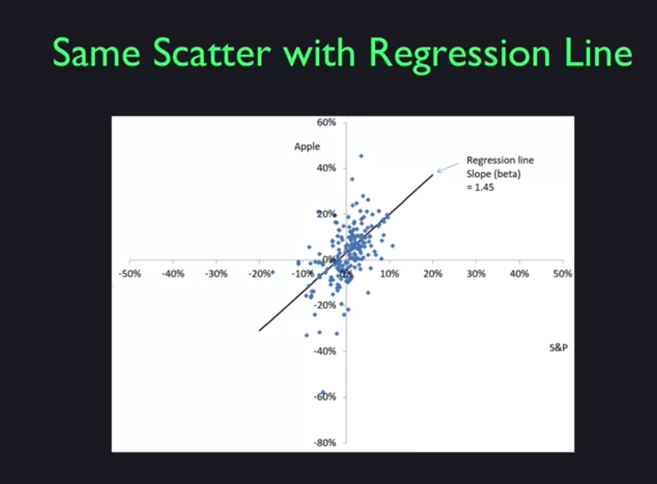
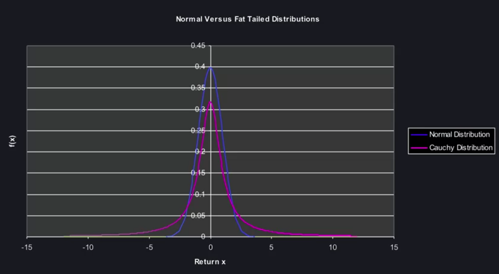
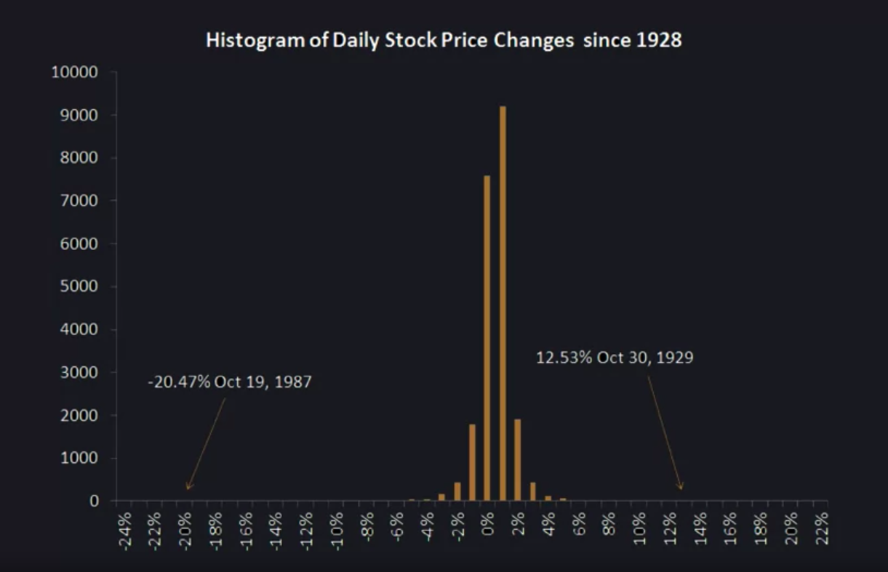
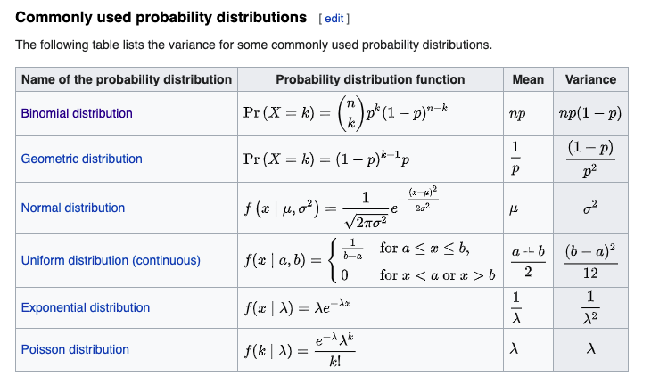
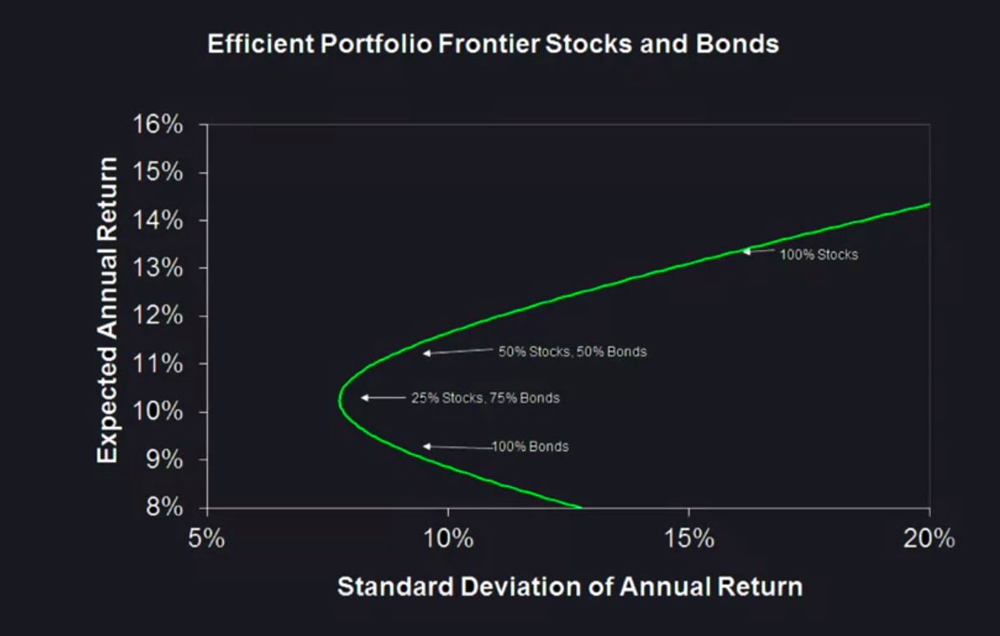

# Financial Markets Week One

# Lesson 1

VaR (Value at Risk):

Definition: 
- Value at risk (VaR) is a statistic that measures and quantifies the level of financial risk within a firm, portfolio or position over a specific time frame. 
Ex.

1% one-year VaR of 10 M means 1% chance of losing 10M in a year period.

# Methods for calculating risk:

Stress Test:

Method of assesing risk based on history, and vulnerabilities.
(Like crisis)

Variance Method: assumes returns normally distributed, based on standard deviation and return

Monte Carlo Method: model to predict investment prices, to determine worst case loss.

# S&P 500

Standard and Poor's 500 stock price index is used as a benchmark for returns.

# Market Risk vs Ideosyncratic Risk

In a simple linear regression line ($y = \beta x + \alpha$) correlating a stock to the S&P the beta says how much the stock reacts to the market.

Ex. Apple vs S&P

Market Risk:

- Risk of the whole market (Beta can be a measure of risk)

Ideosyncratic Risk:

- Stock specific risk

# Distribution and Outliers

Finance tends not to follow a normal distribution, this is because outliers are way more likely.

Usually a fat tail distribution fits better. (ex. Cauchy Distribution)

* In a normal distribution it would be almost impossible to have something 4 distributions away but these type of outlier happens, thats why fat tailed distribution work better.

Example of real data following Cauchy Distribution

Central Limit Theorem:

* Most of the time these are fat tailed, so the average could not be representative.

# Variance 

It's a measure of dispersion, how far are numbers spread from their average

Some variances by distributions:

# Covariance

In probability theory and statistics, covariance is a measure of the joint variability of two random variables.

Usually we want a covariance of zero meaning they are independent.

* Very important for risk management of the portafolio, low covariance.

We should try to risk spread.

There is a relation ship between $\beta$ and the covariance:

$\beta = \frac{COV(r, r_{market})}{Var(r_{market})}$

Its a scaled down version of the covariance.

# Law of great numbers

Ex.
n items with independent probability will have a binomial distribution where the standard deviation is $\sqrt{p(1-p)/n}$

As n gets large the standard deviation goes to zero.

Risk pooling: source of all value in insurance

Moral Hazard: Happens when people take more risk just because they are insured.

Selction Bias: Maybe only sick people want to get insured.

* You can manage risk with insurance policies.

# Diversification

Manage risk through diversification, dont put all the eggs in one basket.

What should matter is the performance of the whole portafolio, not a specific stock. You care about the average return and the uncertainty of the returns.

# Short Sales

Hold negative quantity of sell, borrow share and sell it. Now you owe the share.

* Search for leverage to the hilt. Increase risk and expected return.
* You shortsale riskless asset then invest in risky asset. Pay what you owe and get your expected return. This will depend on the leverage ratio. You could easily go bankrupt, the higher the leverage. (You are open to very small moves from the mean)

# Eficient Portafolio Frontier

