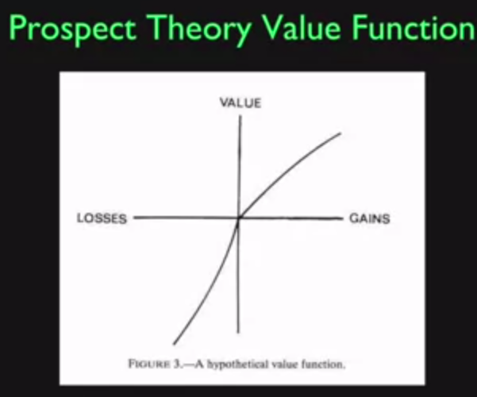
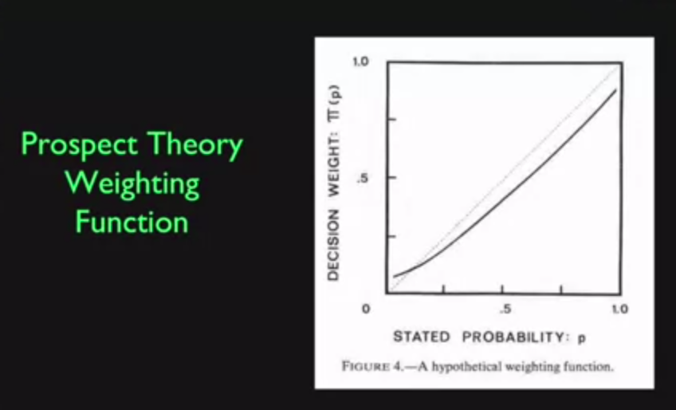

# Week Two Financial Markets

## Invention Takes Time

- Sometimes there's resistance
- Reframe risk

## Limited Liability

- Investors in order to be encourage to invest, should have protection against liability.
- If you have shares of a company you shouldnt be liable for the companies actions. 
- Limited liability laws started in NYC. (Lottery Effect)
- This allows investors to hold a diversified portafolio.

## Inflation Indexed Debt

- Its a better indexation method than indexing debt based to a commodity with a potential unstable price
- Protects investors from currency instability 

* Necesity is the mother of invention.

## Unidad de Fomento

- Value is tied to the consumer price index
- A non circulating currency, adjusted for inflation relative to the chilean peso so its value remains constant.

## Real Estate:  Risk Management Devices

- Value of homes is a mejor source of risk
- Casualty insurance
- Securitized mortages
- Equity-protected mortages

* Home price risks.

Inovating in handling risk of investments in human capital (like choosing very specific career)
- You could short the specific market.

## Forecasting

- Its a random walk, you cant forecast it.
- Auto Regressive Model
- Is the market a random walk or AR-1

## Intuition of Efficiency (theories)

- Prices in the market are set by the ideas of lots of people.
- "Security prices accurately reflect available information, and respond rapidly to new information as soon as it becomes available." Richard Brealey
- Markets are sometimes very off. People used to think that they showed the price exactly.

Ideas of efficiency:

- Weak form efficiency: prices incorporate information about past prices.
- Semi-Strong form: incorporate all public information
- Strong form: all information, including inside information

Counter: 
Somethings may be better explained by psycological/behavioral theories.

## Price as PDV (present discounted value) of Expected Dividends

If companies are priced high relative their income it might be because of their low risk or high growth expectation acording to the Gordon Model. $P=\frac{E}{r-g}$ , $P/E = \frac{I}{r-g}

- The Price / Earnings ratio tells us how much an investor is willing to pay per earning unit of a company.

## Doubts on Efficiency

- Influence of people, human emotions.

## Behavioural Finance

- We prefer praiseworthiness instead of being praised for things we didnt do.

### Prospect Theory

- Experimental based set of knowledge that people make.

They dont treat gains and losses equivalently. 
We give more value to losses.
- Value function, will make different desicions relative to where you stand.
- Take big risks to escape losses.

- Weighting function

- We tend to round low probability to 0 and high probability to 1.

## Logical Fallacies

- Wishful thinking bias,
- Overconfidence bias
-  Cognitive Disonance : mental conflict when one learns one's beliefs are wrong. Avoidance behaviour.

## The brain (mental compartments)

- Having the safe portafolio / risky portafolio

## Atention anomalies

- We tend to pay attention to the same things other people.

## Anchoring

- Subconsious anchoring behaviour

## Representative Heuristic

- People judge by similarity to familiar types, without regard to base rate probabilities

## Disjunction Effect

-  Inability to make a decision that is contingent on future information

## Magical Thinking

- Creating fake ideas that will predict future. Supersition

## Quasi-Magical Thinking

- Thinking you will affect the outcome of something (votations), 
example experiment:

- Subject is told that ca computer knows pretty well wheter the subject will choose box A or both box A and B. Computer puts 1000 in box A, and 1000000 in box B if it thinks subject will choose B alone, otherwise puts nothing in box B.

People tend to choose only B as if choosing both would change the predicted value.

## Culture and Social contagion

- Collective memory

## Sociopathy

- Egocentric
- Self-direction
- Manipulative
- Risk-taking

## Borderline (more common in women)

- Instability of interpersonal relations
- Extreme over idealization
- Depressed moods lasting hours to days
- Intense anger
- effort to avoid real or imagined abandonment