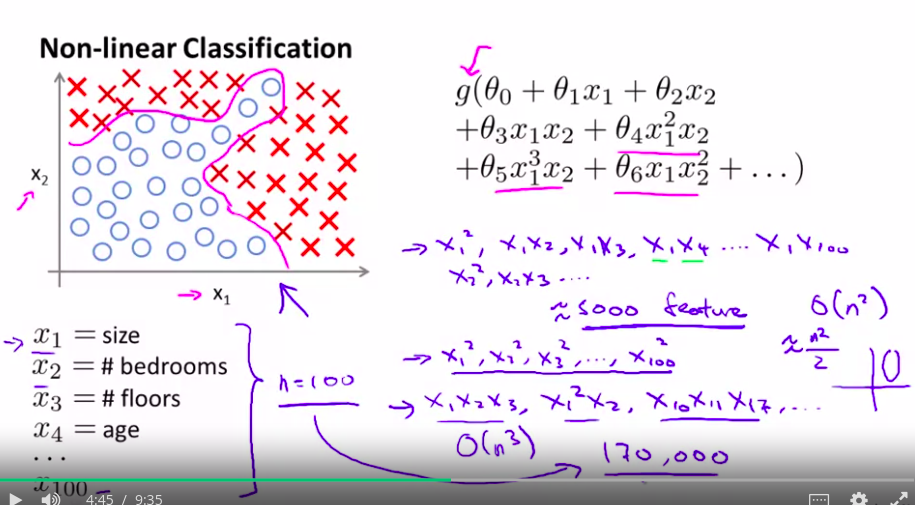

# We need a non-linear hypothesis

Suppose we used a 100x100 pixel image to train a model that can detect a car.
We need a non-linear hypothesis, but using regression is unfeasable.

If we calculate the number of cuadratic features for a 100x100 we obtain over 50 Million. (If it is  b & w )

Using neural networks make this better.

# Neural Networks

Algorithm that has tried to mimic the brain.

It is still a computational heavy algorithm.

* Neuro rewiring cortex

Brain is amazing at using new data, infinite plugins xD

