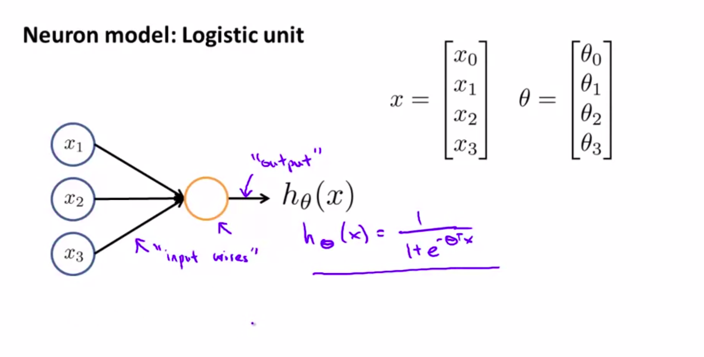
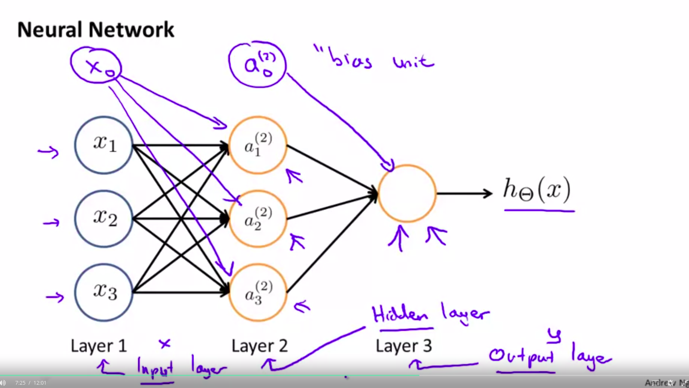
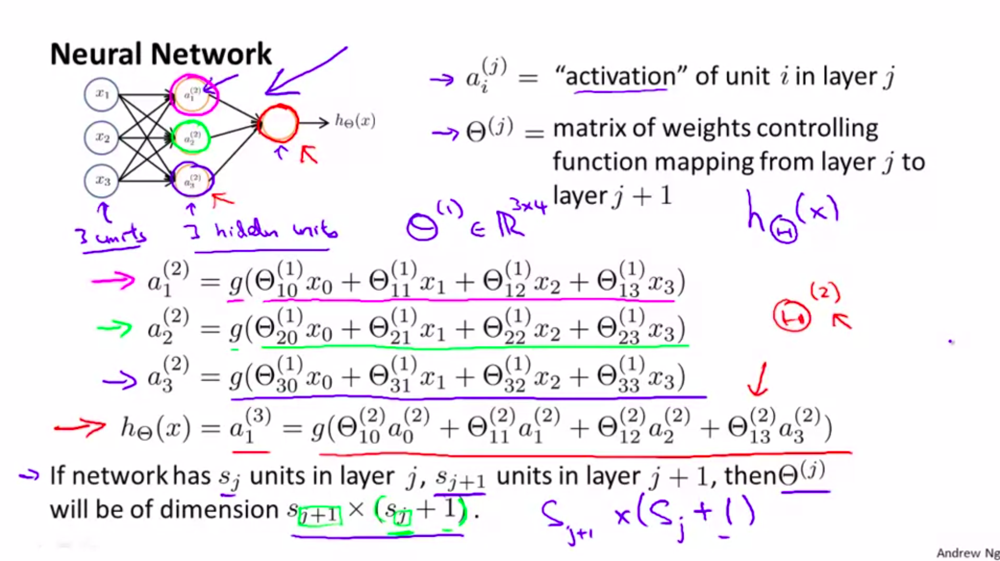
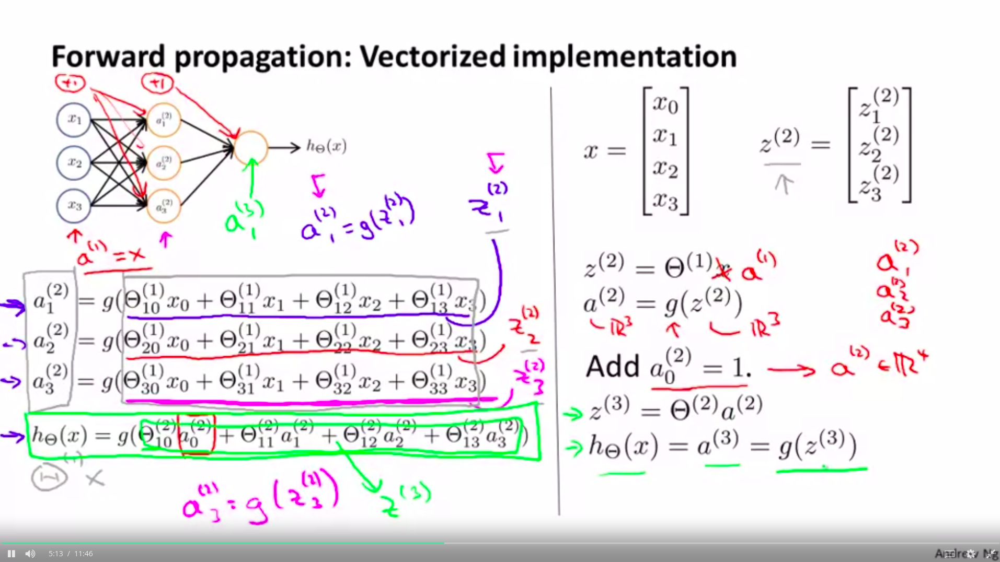
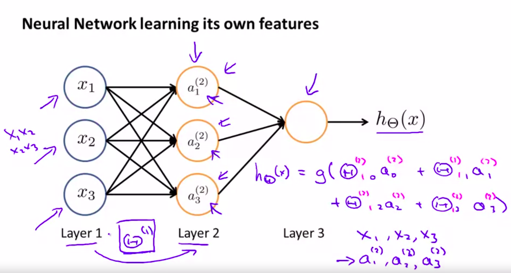

## Neural Networks

### Hypothesis Representations

- Dendites (input) -> Nucleus (computation) -> Axons (output)
- Based on electric pulses and neurotransmitters

### Neural Model Logistic unit

Sometimes we have a term $x_{0}$ for the bias.

This is a sigmoid(logistic) activation function. (non linearity)

We may called thetas as weights.

- A neural network is a group of these neurons.

## Notation and simple computation

## Model Representation 2 (vectorization)

# Forward Propagation

## We can see that the neural network learns from its own features.

We can observe the embeded logistic regression at the and in the intermediary steps.

## neural networks architectures

How the layers are connected.

# more notation

$x^{(j)} = \theta^{(j-1)}a^{(j-1)}$

where $\theta^{(j-1)} \in R^{s_{(j+1)}*(s_j + 1)}$
