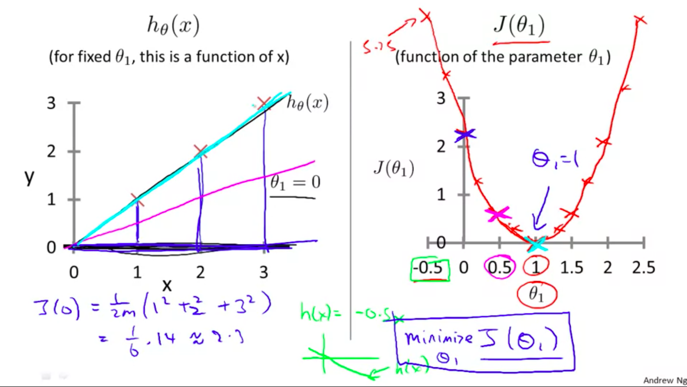
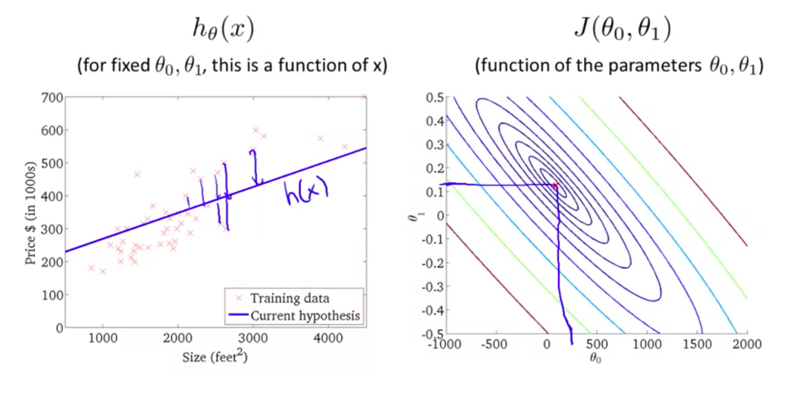

## Model and Cost Functions

# Supervised Learning

### Regression Problem

Predict real valued output

### Classification

Discrete valued output

# Notation

m = Number of training examples
x's = input variable / features
y's = output variable / target variable

($x_{i}$, $y_{i}$)= ith example

# Pipeline

Training Set -> Learning Algorithm -> h(...)

h(...) is a function that maps from ${x}$'s to ${y}$'s

Goal is for h(...) to be a good predictor for ${y}$.

## Representation of h (Ex. Linear regression, univariate)

$h_{\theta}$(x) =$\theta_{0}$ + $\theta_{1}x$

* if continuous (regression) 

# Cost Function

We want to choose the theta's (parameters) that are closer to y, in our training (x,y)

Minimize over theta's, $\sum_{i=0}^{m} (h_{\theta}(x_{i}) - y_{i})^2$ * $\frac{1}{2m}$
* Minimizing half of something should yield the same params (used to make easier computation)

COST_FUNC = $\sum_{i=0}^{m} (h_{\theta}(x_{i}) - y_{i})^2$ * $\frac{1}{2m}$, J($\theta_{0}$,$\theta_{1}$) (square error cost)

Ex. when $h_{\theta}(x_{i}) = \theta_{1}x$

* $\theta_{0} = 0$

* By choosing a $\theta_{1}$ we are minimizing J($\theta_{0}$,$\theta_{1})$ wich in turn gives us the best hypothesis (one with the smallest error) in this case $\theta_{1} = 1$, $h_{\theta}(x) = x$

Remember that the cost function is in terms of the parameter, and that the hypothesis is a function of x with a fixed parameter.

Ex. when we have more than one param

