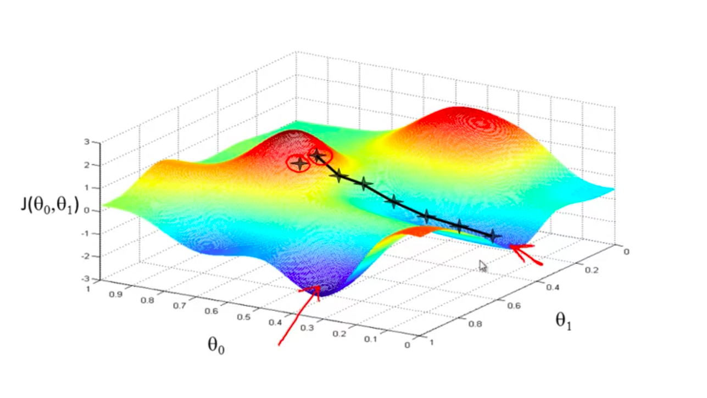
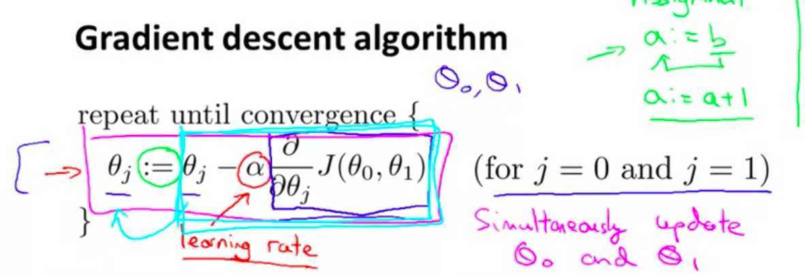
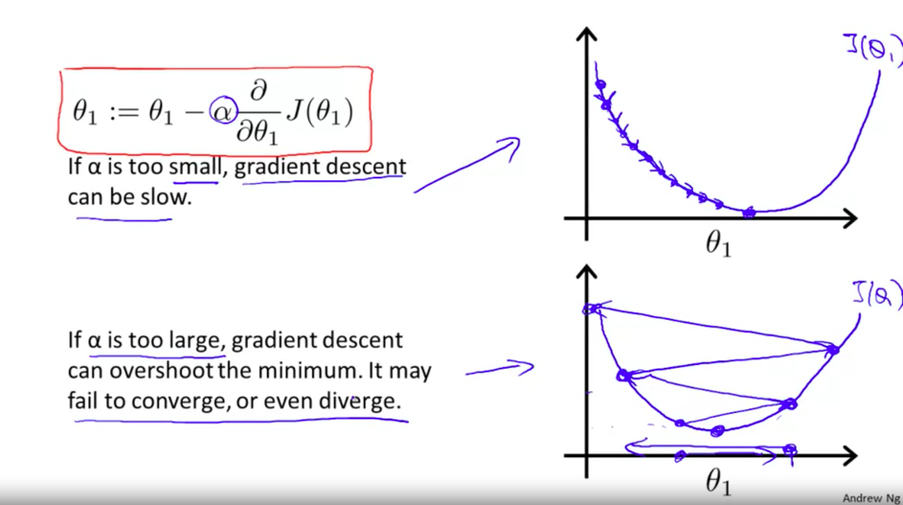
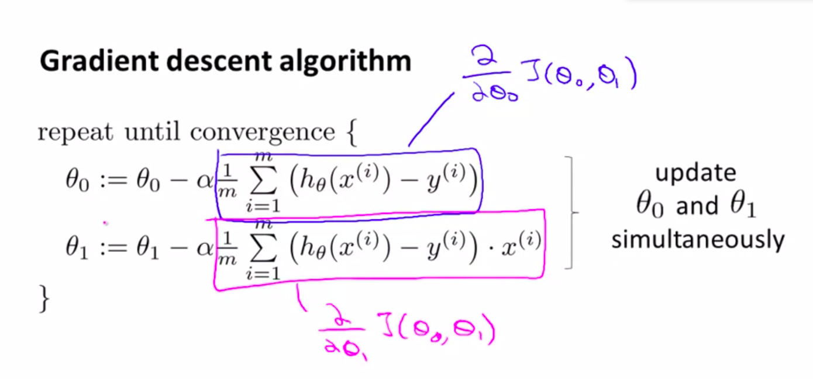
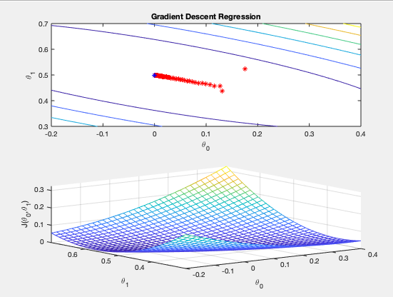

## Parameter Learning

# Gradient Descent

Algorithm to find a minimum

- We have $J({\theta_{0},\theta_{1},...})$
- We choose some $\theta$'s 
- We move slowly towards the greatest descent until converge

Math:

- j subindex stand for all parameters.
- We are moving in the negative direction of the gradient, $\alpha$ is the learning rate, this will determine how fast we move.

## Learning Rate tradeoff

- Gradient descent will take smaller steps as it aproaches a local minima (slope becomes smaller)
- No need to decrease $\alpha$ over time

## Example In Linear Regression

- There is no local minima, just global

# Batch Gradient Descent

- It means that in each step we use all training examples (we use sums)

# Extra

* Check regression_grad_desc.py for a matlab implementation of gradient descent applied to simple linear regression.

