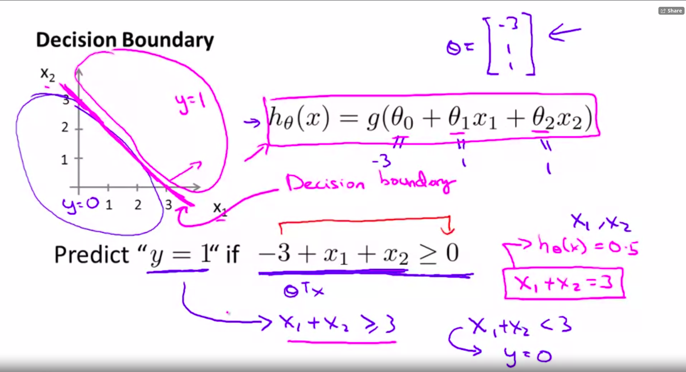
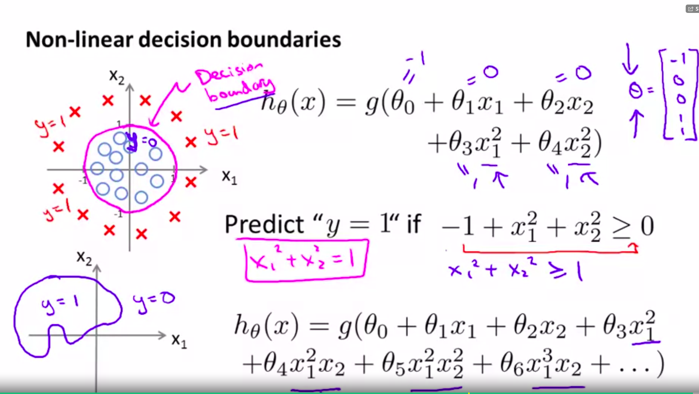

### Two class clasification (0 - 1) Binary Classification

$y \in \{0,1\}$

$H_{\theta}(X) = \theta^T x$

Using linear regression: 
Threshold classifier output $h_{\theta}$ at 0.5:

- if $h_{\theta}$ >= 0.5,  predict y = 1
- if $h_{\theta}$ < 0.5, predict y = 0

Weird that  $h_{\theta}$ can be more than 1 and less than 0.

## Logistic Regression (Classification)

$0 \leq h_{\theta}(x) \leq 1$

Hypothesis Representation:

- $ h_{\theta}(x) = g(\theta^T x)$ where g is the sigmoid/logistic function.
- $ g(z)$ =  $\frac{1}{1 + e^{-z}}$
- $ h_{\theta}(x)$ = $\frac{1}{1 + e^{-\theta^T x}}$

Interpretation of Hypothesis Output:

$h_{\theta} = $ estimated probability that y = 1 on input x

$h_{\theta}(x) = P(y=1|x;\theta) $ "Probability that y=1, given x, parameterized by $\theta$"

Properties: 
- $P(y = 0| x; \theta) +  P(y=1|x;\theta) = 1 $

- $P(y = 0| x; \theta) = 1 -  P(y=1|x;\theta)$

## Decision Boundary 

* Property of the hypothesis

We can use polynomial regression in logistic regression, we would get non-linear decision boundaries

