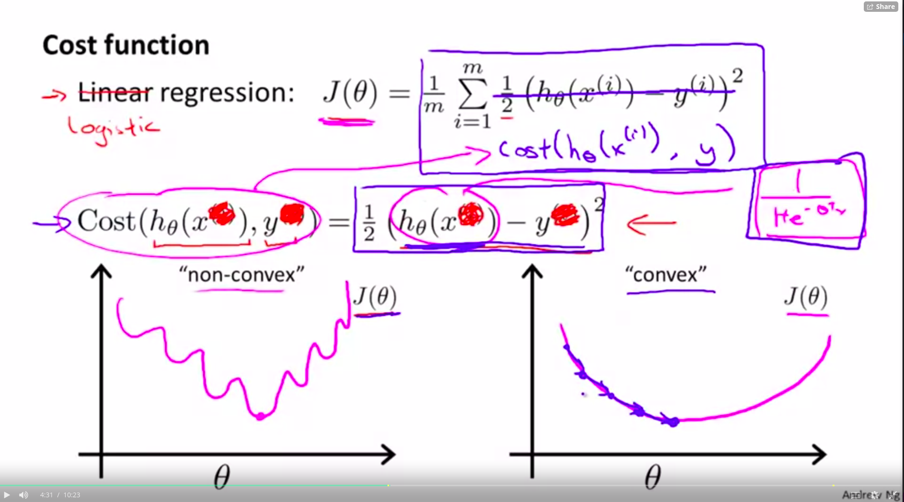
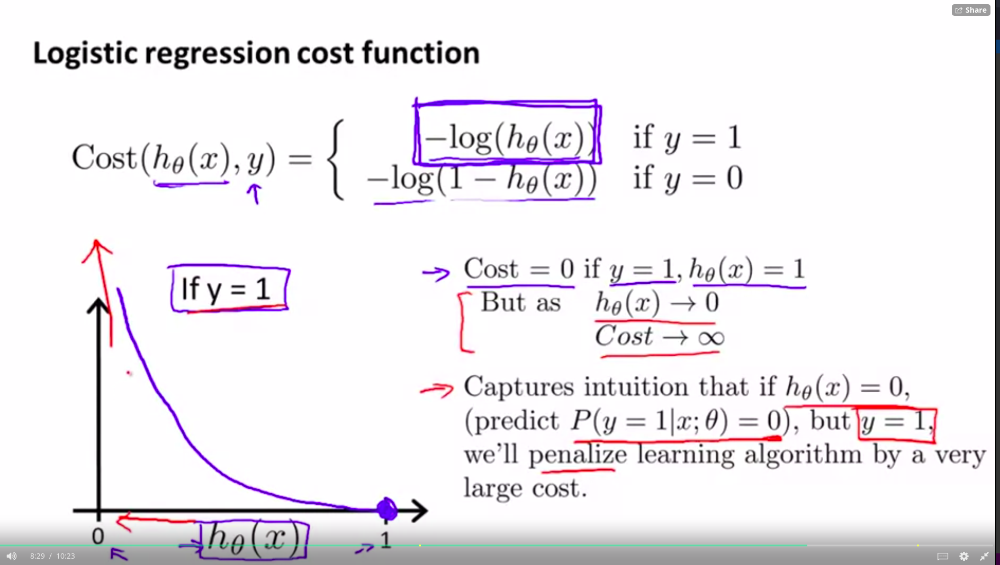
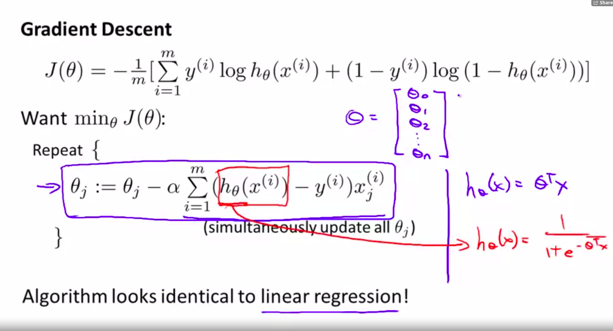
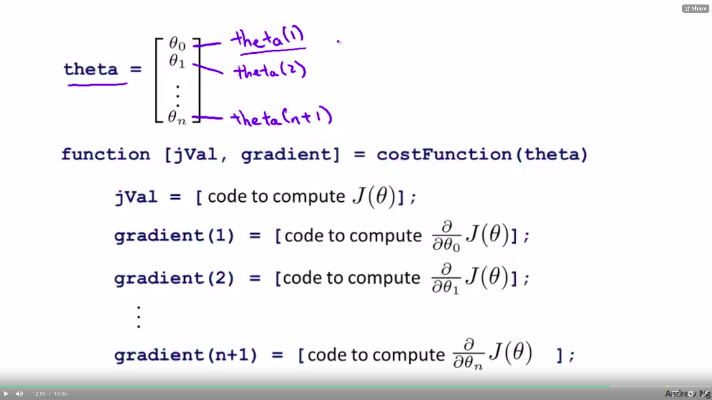

# Logistic Regression

### Cost Function

Sigmoid function results in a non-convex cost function, this doesnt guarantee the global minimum when running gradient descent.

It's the same but inverted for y = 0 , it really penalizes when its wrong.

* convex analisis

## Simplified Cost Function and Gradient Descent
* Note $ y \in \{0,1\} $
* $Cost(h_{\theta}(x),y) = -ylog(h_{\theta}(x) -(1-y)log(1-h_{\theta}(x)))$ (Like a step function)

* principle maximum likelyhood estimation

## Gradient Descent

- https://math.stackexchange.com/questions/477207/derivative-of-cost-function-for-logistic-regression

- $h = g(X\theta)$
- $J(\theta) = \frac{1}{m} \cdot (-y^{T}\log(h)-(1-y)^{T}\log(1-h))$

vectorized gradient descent

- $\theta = \frac{a}{m}X^T (g(X\theta) - y)  $

## Advanced Optimization

- Gradient Descent
- Conjugate gradient
- BFGS
- L - BFGS

Some advantages for the algorithms (not gradient descent) are
you dont need to pick $\alpha$ manuelly and it often converges faster.

Although its more complex.

* Already in matlab.

- example options: options = optimset('GradObj', 'on', 'MaxIter', 100);
- Use fminunc(@costFunction, initialTheta, options)