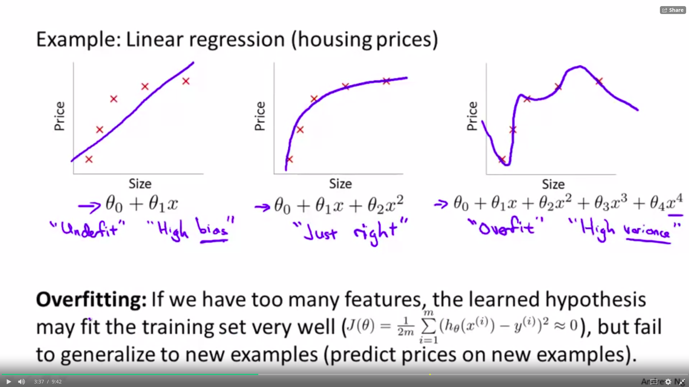
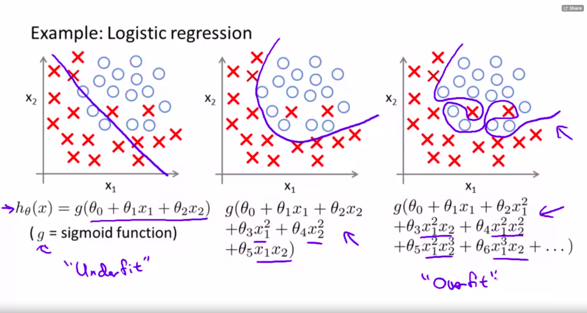
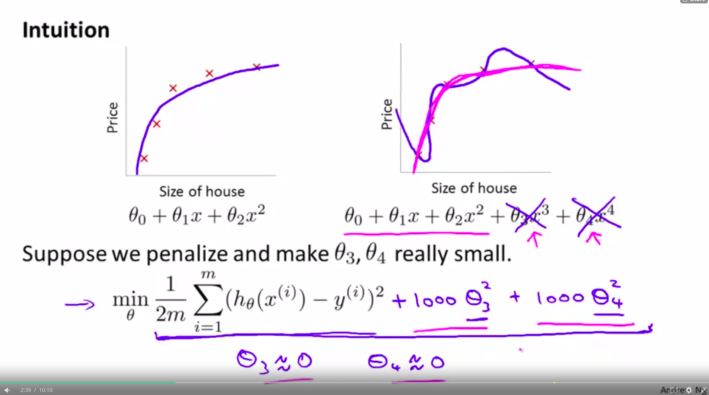
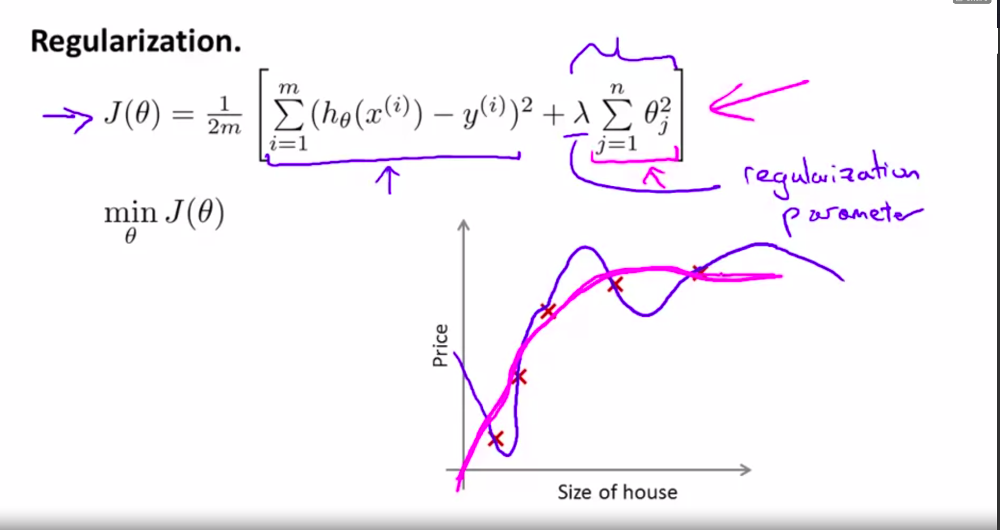
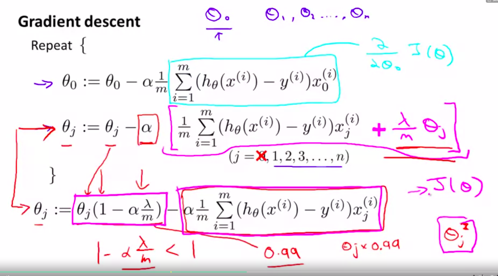
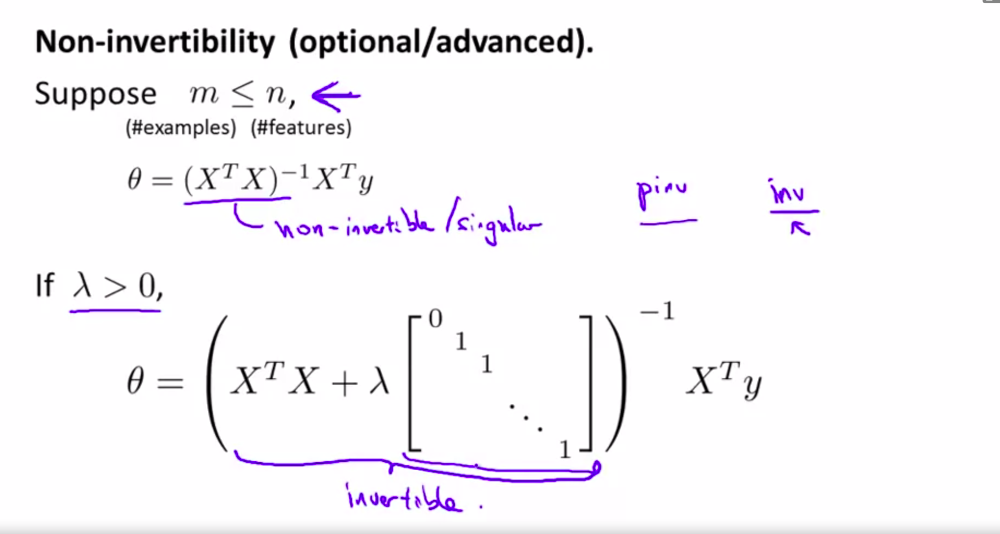
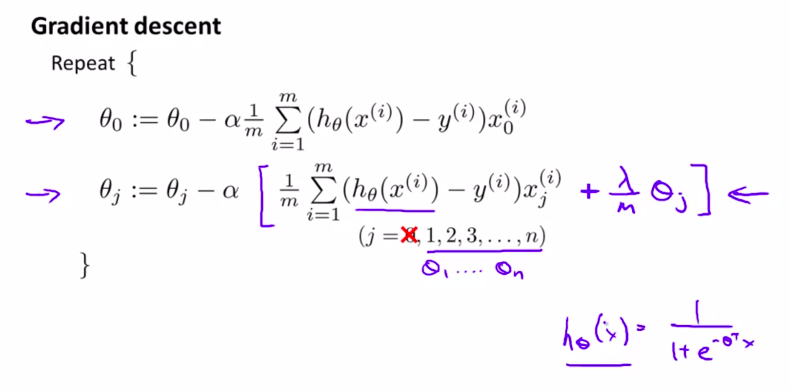

## Overfitting Problem

### Linear regression

### Logistic Regression

## How to address overfitting

- Reduce number of features, selection algorithm
- Regularization (keep all features, reduce magnitud/ values of parameters $\theta j$)

## Regularization Intuition

- We can penalize parameters.
- Small values of parameters usually imply a simpler hypothesis.

- We can add a regularization parameter, where we penalize all the variables given that we dont know wich one is too large

- If we use a lambda with a very big value we can end up underfitting
(like removing all parameters)
- A very small lambda could result in overfitting.

## Examples:  Regularized Linear Regression

- We see that $\theta_{j}$ gets shrinked.

### Normal equation

If you use the normal equation method, after deriving the new formula we can see that the matrix will always be invertible thanks to the lambda*almost identity. This makes the matrix full rank.

## Examples: Regularized Logistic Regression 

