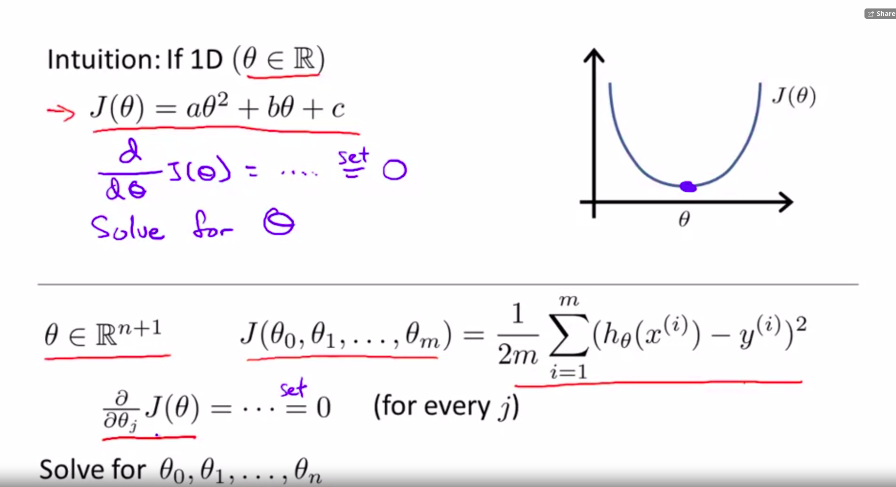

# Computing Parameters Analitically

# We can use the normal equation method

## Intuition

In this case we dont require feature scaling

$\theta = (X^T X)^{-1}X^T y$

Gradient Descent vs Normal Equation

G.D:

* Need to choose $\alpha$
* Needs many iterations
* Works very well even if $n$ is large

Normal Eq:

* No need to choose $\theta$
* Don't need to iterate
* Need to compute $(X^T X)^{-1}$
* Slow if n is large

To see a derivation check out: 

- https://machinelearningmedium.com/2017/08/28/normal-equation/

# Normal Equation Noninvertability

Reasons for noninvertability

*  Linear Dependance
*  Too many features ($m <= n$) ( Delete features or use regularization )