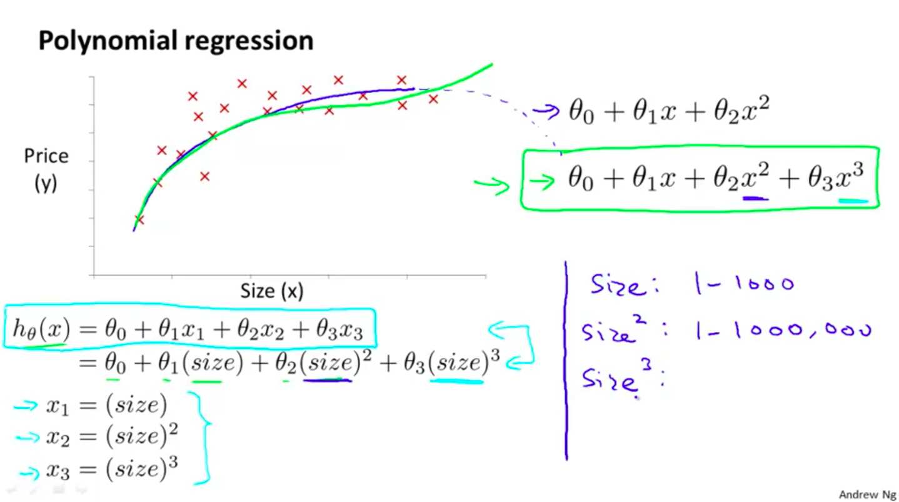

## Multivariate Linear Regression

### Notation

* Another common notation is to have i,j as a subscript; $X_{i,j}$

#### Hypothesis

The new expression can be represented with linear algebera as:

$h_{\theta}(x) = \theta^Tx$ (x being a row)

* X contains the features

## Gradient Descent

* Remember we can say that $x_{0} = 1$ 

# Feature Scaling

* We can scale the features so all of them have the same "importance",
gradient descent will be faster

# Mean normalization

* Forcing the mean to around 0

# Feature Engineer

* We can sometimes modify our data to create more data, data with more signifiance. For example area instead of using longitud and depth individually.

# Polynomial regression

We can use the machinery of multivariate regresion by affecting our features.

* Remember to think about the ranges of the values, in order to feature scale.